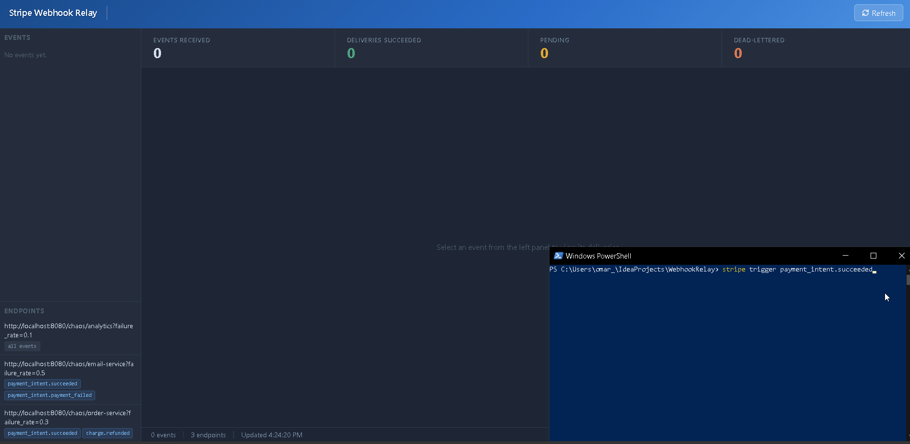

# Stripe Webhook Relay

Receives a single inbound Stripe event and fans it out to multiple registered downstream services. Includes per-endpoint event-type filtering, exponential backoff retry, dead-letter handling, and manual replay.

## Contents

- [Tech Stack](#tech-stack)
- [Motivation](#motivation)
- [Architecture](#architecture)
- [Key Design Decisions](#key-design-decisions)
- [API Reference](#api-reference)
- [Running Locally](#running-locally)
- [Configuration](#configuration)
- [Production Considerations](#production-considerations)
- [Dashboard](#dashboard)
- [Demo](#demo)

---

## Tech Stack

- Java 21, Spring Boot 3.2
- PostgreSQL, Flyway
- Micrometer, Prometheus
- Stripe Java SDK
- Docker

---

## Motivation

Stripe fires one webhook per event. A `payment_intent.succeeded` event needs to reach the order service, the email service, and the analytics pipeline where each has different uptime characteristics.

HookRelay sits between Stripe and those services. It fans the event out to every subscribed endpoint and handles delivery independently. If the email service is down, the order service still gets its event. Failed deliveries retry on exponential backoff and dead-letter after a configurable number of attempts.

---

## Architecture

```
Stripe
  |
  | POST /webhooks/stripe
  v
+------------------+
|  Ingest Layer    |  Validates Stripe signature
|                  |  Deduplicates via stripe_event_id
|                  |  Writes event + delivery rows
+------------------+
         |
         | (one delivery row per matching endpoint)
         v
+------------------+
|  Delivery Worker |  SELECT FOR UPDATE SKIP LOCKED
|  (N threads)     |  Dispatches HTTP POST per delivery
|                  |  Classifies failures (4xx vs 5xx/timeout)
|                  |  Schedules retries with jitter
+------------------+
    |        |        |
    v        v        v
 Order    Email   Analytics
 Service  Service  Service
```

### Database schema

```
endpoints         events                deliveries
----------        ----------            ----------
id                id                    id
url               stripe_event_id*      event_id -> events
event_types[]     type                  endpoint_id -> endpoints
created_at        payload (JSONB)       status
                  received_at           attempts
                                        next_retry_at
                                        last_attempted_at

delivery_attempts
-----------------
id
delivery_id -> deliveries
attempted_at
http_status
latency_ms
outcome
```

`*` unique constraint that prevents duplicate processing when Stripe retries delivery

---

## Key Design Decisions

**`SELECT FOR UPDATE SKIP LOCKED`**
Multiple worker threads poll the deliveries table concurrently. SKIP LOCKED lets each thread claim a row without blocking on rows held by another. No external queue needed.

**At-least-once delivery:**

Exactly-once would require a distributed transaction spanning the DB write and the outbound HTTP call. HookRelay delivers at-least-once, the same guarantee Stripe itself offers. Downstream services handle duplicates with their own idempotency keys.

**Failure classification:**

A 4xx response means the endpoint rejected the payload structurally, retrying won't help, so the delivery dead-letters immediately. A 5xx or network timeout is treated as transient and enters the retry schedule.

**Exponential backoff with jitter:**

Retry delays follow `base * 2^attempt + random(0, delay * 0.25)`. Without jitter, workers retrying from a shared outage hit the recovering service at identical intervals. Jitter spreads the load.

**Virtual threads:**

Workers are I/O-bound, blocked on outbound HTTP. Virtual threads (Java 21, `spring.threads.virtual.enabled=true`) let the JVM schedule other work on the carrier thread during that wait.

**Startup recovery:**

On boot, any deliveries left in `in_progress` from a previous crashed instance reset to `pending`. Without this, a mid-dispatch crash leaves those rows permanently stuck.

---

## API Reference

### Ingest

| Method | Path                | Description                    |
|--------|---------------------|--------------------------------|
| POST   | `/webhooks/stripe`  | Receives Stripe webhook events |

Requires a valid `Stripe-Signature` header. Returns 400 on invalid signature. Idempotent, duplicate events return 200 with no side effects.

### Admin

All admin routes require the `X-Admin-Key` header.

| Method   | Path                               | Description                                      |
|----------|------------------------------------|--------------------------------------------------|
| POST     | `/admin/endpoints`                 | Register a subscriber endpoint                   |
| GET      | `/admin/endpoints`                 | List all endpoints                               |
| DELETE   | `/admin/endpoints/{id}`            | Remove an endpoint                               |
| GET      | `/admin/events`                    | List recent events                               |
| GET      | `/admin/events/{id}/deliveries`    | List deliveries for an event                     |
| POST     | `/admin/events/{id}/replay`        | Replay all dead-lettered deliveries for an event |
| GET      | `/admin/deliveries/{id}`           | Get a single delivery                            |
| GET      | `/admin/deliveries/{id}/attempts`  | Full attempt history for a delivery              |
| POST     | `/admin/deliveries/{id}/replay`    | Replay a single dead-lettered delivery           |

### Register endpoint example

```bash
curl -X POST http://localhost:8080/admin/endpoints \
  -H "Content-Type: application/json" \
  -H "X-Admin-Key: local-admin-key" \
  -d '{
    "url": "https://your-service.example.com/events",
    "eventTypes": ["payment_intent.succeeded", "charge.refunded"]
  }'
```

Pass an empty `eventTypes` array to subscribe to all event types.

### Chaos endpoint

```
POST /chaos/{service}?failure_rate=0.4&latency_rate=0.2
```

Returns 500 at `failure_rate` probability and injects a 5-second delay at `latency_rate` probability. Used in the demo to simulate unreliable downstream services.

---

## Running Locally

### Prerequisites

- Docker Desktop
- Java 21
- [Stripe CLI](https://stripe.com/docs/stripe-cli)

### Steps

**1. Start Postgres**
```bash
docker-compose up -d
```

**2. Configure local properties**
```bash
cp src/main/resources/application-local.properties.example \
   src/main/resources/application-local.properties
```

**3. Run the app**

In IntelliJ, set `local` as the active Spring profile in the run configuration.

Or from the terminal:
```bash
SPRING_PROFILES_ACTIVE=local ./mvnw spring-boot:run
```

**4. Start Stripe CLI forwarding**
```bash
stripe listen --forward-to localhost:8080/webhooks/stripe
```

Copy the signing secret printed by the CLI and update `application-local.properties`:
```
hookrelay.stripe.webhook-secret=whsec_your_secret_here
```

Restart the app.

**5. Register demo endpoints**
```bash
bash scripts/register-demo-endpoints.sh
```

> On Windows, run this from the IntelliJ terminal (Git Bash) rather than PowerShell.

Registers three chaos consumers as order-service, email-service, and analytics (each with different failure rates)

**6. Trigger a test event**
```bash
stripe trigger payment_intent.succeeded
```

**7. Inspect delivery state**

Open the dashboard at [http://localhost:8080/dashboard.html](http://localhost:8080/dashboard.html), or use the API directly:

```bash
curl -H "X-Admin-Key: local-admin-key" http://localhost:8080/admin/events/1/deliveries
curl -H "X-Admin-Key: local-admin-key" http://localhost:8080/admin/deliveries/2/attempts
curl -X POST -H "X-Admin-Key: local-admin-key" http://localhost:8080/admin/deliveries/2/replay
curl http://localhost:8080/actuator/prometheus | grep hookrelay
```

---

## Configuration

| Property                            | Env var                  | Default           | Description                    |
|-------------------------------------|--------------------------|-------------------|--------------------------------|
| `hookrelay.worker.thread-count`     |                          | `4`               | Delivery worker thread count   |
| `hookrelay.worker.poll-interval-ms` |                          | `1000`            | Idle poll interval in ms       |
| `hookrelay.worker.http-timeout-ms`  |                          | `10000`           | Outbound HTTP timeout in ms    |
| `hookrelay.retry.max-attempts`      |                          | `5`               | Attempts before dead-lettering |
| `hookrelay.retry.base-delay-ms`     |                          | `30000`           | Base retry delay in ms         |
| `hookrelay.retry.jitter-factor`     |                          | `0.25`            | Jitter as fraction of delay    |
| `hookrelay.stripe.webhook-secret`   | `STRIPE_WEBHOOK_SECRET`  |                   | Stripe webhook signing secret  |
| `hookrelay.admin.api-key`           | `ADMIN_API_KEY`          | `local-admin-key` | Admin route key                |

---

## Production Considerations

**Polling vs queue-based dispatch:**

The worker polls the database on a tight loop. At higher event volume, a message queue (SQS, Kafka) would let workers block on a message rather than querying continuously. The schema and worker logic would transfer cleanly.

**Horizontal scaling:**

`SELECT FOR UPDATE SKIP LOCKED` means multiple app instances run safely in parallel without duplicating work. No schema changes required.

**Backpressure:**

No mechanism prevents a slow endpoint from accumulating an unbounded backlog. A per-endpoint circuit breaker or rate limiter would address this in production.

**Observability:**

Micrometer counters and a latency timer are exposed via `/actuator/prometheus`. A full setup would add distributed tracing (OpenTelemetry) and dead-letter rate alerting.

---

## Dashboard

A read-only dashboard is served at [http://localhost:8080/dashboard.html](http://localhost:8080/dashboard.html). Shows live event status, per-endpoint delivery state, full attempt history, and one-click replay for dead-lettered deliveries.

---

## Demo


